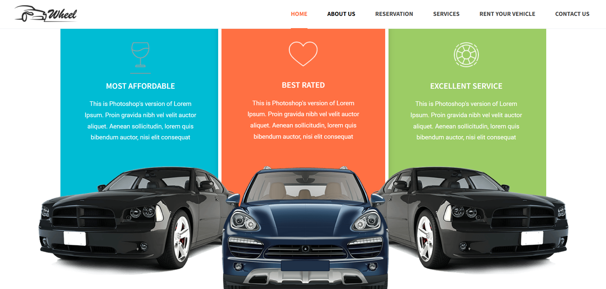
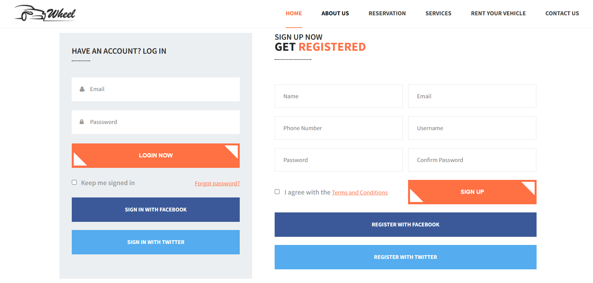
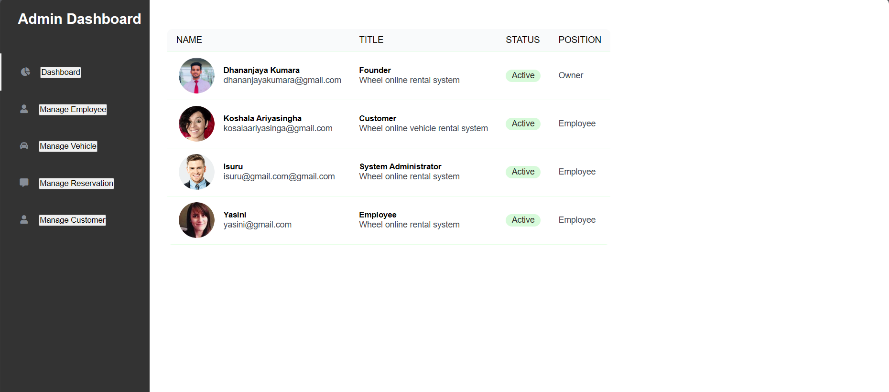

# Online-Vehicle-Rental-System

## wheel-online vehicle rental web application

Wheel-online is a web application that runs on Java and is intended to make renting a car easier. Customers may explore available automobiles, manage bookings, and make secure payments on an easy-to-use interface. Additionally, the program provides strong administration facilities for user account management, vehicle inventory management, and analytical report generation. Utilizing Java's scalability and reliability, wheel-online provides a dependable rental management solution.

## Features

### User Management: 

 Secure registration and login for customers and administrators.

### Vehicle Inventory: 

Comprehensive listings with detailed specifications and availability. 

### Booking System: 

Easy-to-use reservation calendar with real-time availability checks.

### Reporting: 

Generate customizable reports on rentals, revenue, and user activity.

## Screenshots

